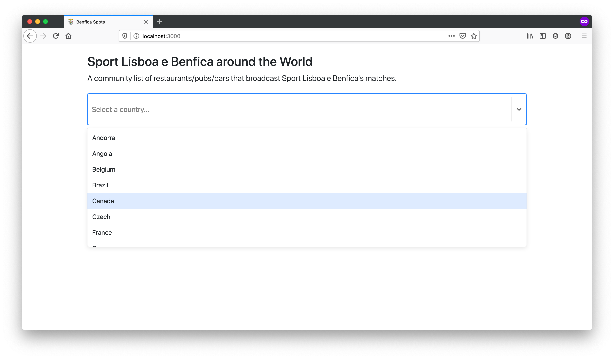
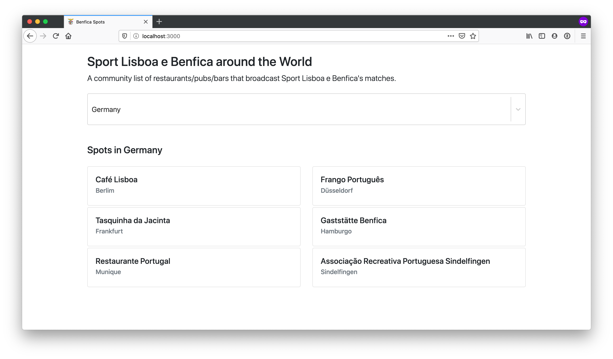

# Benfica Spots

This repository consists of a simple React.js app to list all the spots that broadcast Sport Lisboa e Benfica's matches around the world.

The data was gathered from the community and every one can contribute to add more places and keep it up to date.

## 🧪 Stack

* React 16.13.1
* Yarn 1.19.1
* Bootstrap 4.5.0

## 🚀 How to run

Clone the repository and run:

```bash
$ yarn start
```

This will run the app in the development mode. It will be avaiable at http://localhost:3000 to view it in the browser.

The page will automatically reload if you edit any code.

## 📸 Screenshots





## 🎳 How to contribute

Feel free to add any spots you know in any country that usually broadcast the matches.

To add a spot, simply edit the `spots.json` file and add a new entry in the corresponding country. The content should be in **english**.
